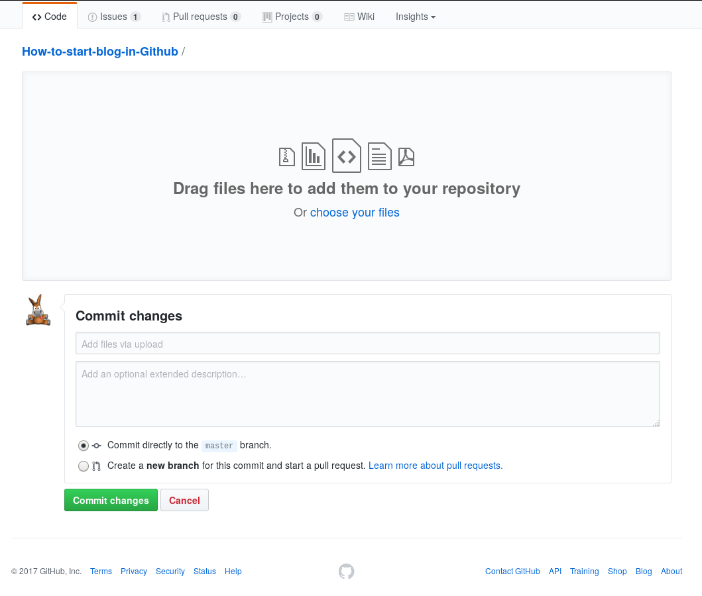

# 用 Markdown 写文章

## 添加文件

您可以使用`Create new file`按钮创建一个新文件，并现场编辑之。

点击*Preview changes*可以预览文件排版后的效果；点击*Edit file*以继续编辑。

我们建议为您每一次对仓库内容的修改都留下一点说明。如果提交说明留空，github 会为您自动生成一个默认的说明。

您也可以使用`Upload file`按钮并在点击页面中央的`choose your files`以直接上传本地已经写好的文件。和在线编辑相同，在下方**Commit Change**处可以书写说明。

当您阅览自己的仓库中的文件时，点击右上方的笔形图标即可在线编辑之。

Github 支持将`.md`文件直接排版为 html 网页，故建议您使用 Markdown 格式撰写文章，并使用`.md`扩展名为文件命名。

或者：

## 添加 Issues

`Issues` 本来是用于反馈的，但我们不妨利用 `Issues` 写文章。而读者也可以利用`Issues`和作者交流。`Issue` 也支持 Markdown 标记语言。

点击导航栏上的`Issues`，然后使用`New issue`按钮添加新 Issue。

## Markdown 简介

Markdown 是一种用来写作的轻量级标记语言，由于简单和 Github 等环境支持对该格式在线排版而流行。其语法教程俯拾即是，举[此一例](https://github.com/Melo618/Simple-Markdown-Guide)供您查阅，在任一搜索引擎上使用`markdown 教程`搜索即可获得更多结果。

您可以使用任何文本编辑器撰写 Markdown 文稿——即使是简陋的`记事本`也没有问题。不过工欲善其事，必先利其器。使用一款支持 Markdown 并带有语法高亮的文本编辑器会对您的编写工作有很大帮助。`GNU/Linux`用户可以使用武装到牙齿的`emacs`、`vi`等专业文本编辑器，即使是`gedit`基础的语法高亮也能提供很大帮助；`M$ Windows`用户则可以尝试一下[Notepad++](https://notepad-plus-plus.org/)，并按照[这篇文章](https://www.iots.vip/post/notepad-support-markdown.html)中介绍的方法进行配置；至于`Mac OS X`的用户么……您可以尝试一下[MacDown](https://macdown.uranusjr.com/)？

本项目中的每一篇文章都可作为例子，在每一页面中点击如上图所示的`Raw`按钮即可查看其 Markdown 源代码。

# [返回目录](./README.md)
